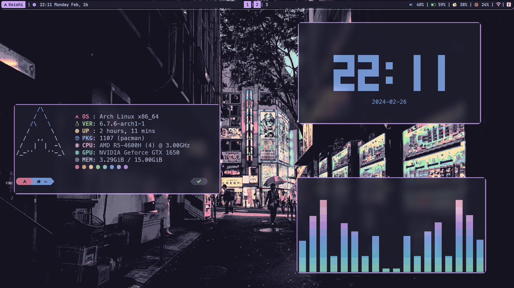
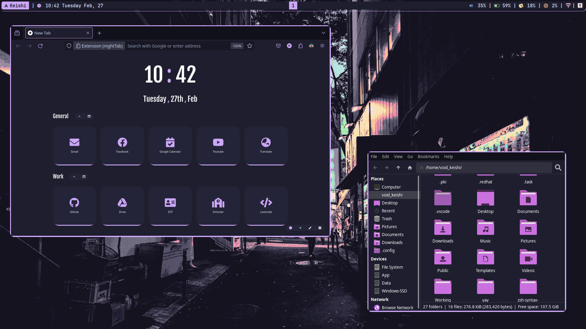
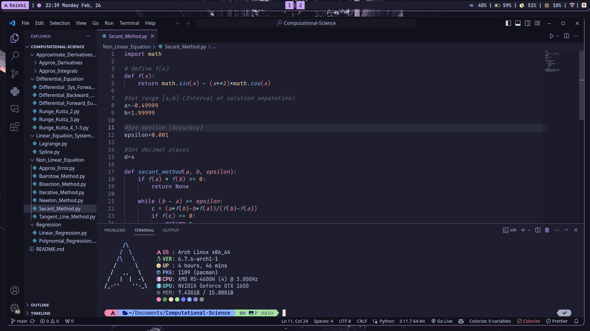

# i3 & compfy with Catppuccin flavor
My personal i3 configuration on Arch Linux

## Screenshot

  
   

  
   

  
   

## Setup
- **OS**: Arch Linux
- **WM**: i3
- **Bar**: Polybar
- **Terminal**: Kitty
- **Shell**: Zsh
- **Compositor**: Compfy
- **Launcher**: Rofi
- **File Manager**: Thunar
- **Browser**: Firefox
- **Wallpaper**: Catppuccin Street & spooky spill
- **SDDM Theme**: Sugar Candy

## SDDM Preview

  
   

